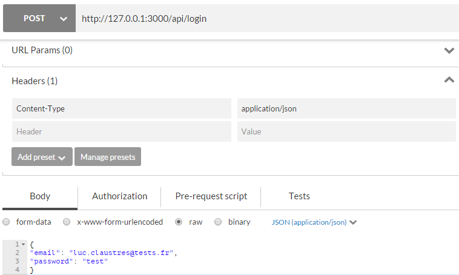
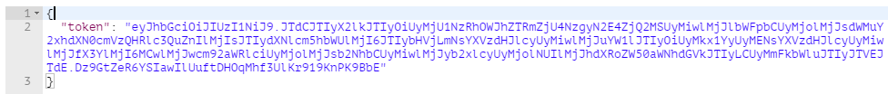
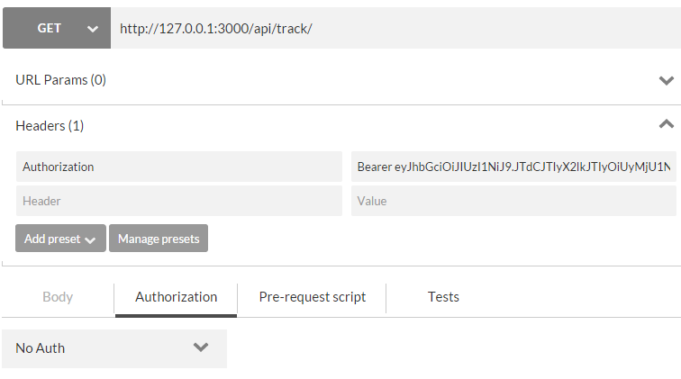

# MEAN.IO (2/3)

Ce second article d'une série consacrée à MEAN.IO va nous permettre d'introduire les principaux concepts permettant de créer un nouveau module afin d'étendre le canevas. Le cas d'application que je vous propose d'étudier permettra également à la plupart d'entre vous de découvrir un autre domaine, celui de la visualisation de données géographiques sous forme de carte ou sous forme 3D. Nous souhaitons en effet créer une application permettant de visualiser un ou plusieurs itinéraires GPS (type randonnée VTT ou pédestre).

## Création d'un module

Tout d'abord un petit rappel, l'ensemble des modules d'une application MEAN.IO est stocké dans le dossier **packages**. Le premier sous-dossier **core** inclut les modules de base livrés avec le framework et le sous-dossier **custom** les modules spécifiques à la logique applicative, c'est donc ici qu'il faudra créer vos nouveaux modules. Grâce à l'outil en ligne de commande [mean-cli](https://www.npmjs.com/package/mean-cli) il est possible d'initialiser un module (scaffolding) via :
```
mean package package_name
```
Il est à tout moment possible de lister vos modules et d'effacer un module en particulier :
```
// Liste les modules présents
mean list
// Efface un module
mean uninstall package_name
```

Le dossier d'un module MEAN.IO présente la structure suivante (un module nouvellement créé peut ne pas contenir tous les dossiers néanmoins) :
```
Module folder
--- docs : contient la documentation de l'API (back-end)
--- public : partie publique du module sur le site
    --- assets : données statiques (images, css, dépendances front-end)
    --- controllers : controllers front-end (AngularJS)
    --- directives : directives front-end (AngularJS)
    --- routes : routing front-end (AngularUI Router)
    --- services : services front-end (AngularJS)
    --- tests : tests front-end (Jasmine)
    --- views : vues (AngularJS)
--- server : contient le code back-end
    --- controllers : controllers back-end (Express)
    --- routes : routing back-end (Express)
    --- models : modèle de données back-end (Mongoose)
    --- tests : tests back-end (Jasmine)
    --- views : vues HMTL (templating Swig)
--- node_modules : contient les dépendances Node.js du module (back-end)
```
> **Trucs & Astuces** : Tous les fichiers à l'intérieur du dossier **public** seront accessibles publiquement à l'URL */nom-module/chemin-relatif-fichier*. Par exemple pour accéder à une image nommé 'logo.png' dans le module nommé 'module' l'URL sera *module/assets/img/logo.png*.

A la racine on trouvera comme dans le cas de l'application les fichiers de configuration pour npm, bower et MEAN.IO (**mean.json**). Le plus important est le fichier **app.js** qui est le point d'entrée du module, à l'intérieur est réalisé l'enregistrement du module dans MEAN.IO. Créons un nouveau module nommé 'application' qui contiendra notre logique applicative, dans le fichier **app.js** généré par défaut nous trouverons ceci :
```
var Module = require('meanio').Module;
// Création du module, ceci va automatiquement charger tous les modèles du sous-dossier models
var Application = new Module('application');
// Enregistrement du module
Application.register(function(app, auth, database) {
  // Déclaration automatique des routes du sous-dossier routes
  Application.routes(app, auth, database);
  // Aggrégation des dépendances front-end (voir article précédent)
  Application.aggregateAsset('css', 'application.css');

  return Application;
});
```
Si votre nouveau module dépend d'autres modules MEAN.IO ou AngularJS il vous faudra rajouter ceci lors du register :
```
Application.angularDependencies(['mean.users']);
```
En effet l'arbre des dépendances est construit côté serveur au lancement de l'application et est récupéré au chargement de la page via une requête sur l'URL */_getModules* côté client. Ceci permet de déclarer alors dynamiquement la liste de tous les modules AngularJS dans le code JS (pour les curieux vois le fichier **bower_components/web-bootstrap/index.js**).

Par défaut MEAN.IO injecte trois dépendances en paramètre du register :

  - **app** : l'application Express,
  - **auth** : un module proposant des fonctions d'authenticatio basiques,
  - **database** : la connexion Mongoose à la base de données.
 
Si votre module dépend d'autres modules (e.g. module1 et module2) ils pourront être injectés à la suite :
```
...
// Enregistrement du module
Application.register(function(app, auth, database, module1, module2) {
  ...
});
```

## Partie serveur (back-end)

### Création du modèle

Le premier travail lors de la création d'un module consiste à définir le modèle conceptuel du ou des objets qui seront manipulés par le module, ce modèle est ensuite exprimé au moyen d'un schéma Mongoose. Dans notre cas l'objet manipulé sera un itinéraire GPS ('track' en anglais). Un tel chemin est simplement décrit par une liste de positions GPS acquises par le capteur. Chaque point est repéré en coordonnées géographiques : longitude, latitude et altitue. A part l'utilisateur qui l'a créé et un descriptif le chemin contiendra donc un tableau de coordonnées. Pour déclarer le modèle il suffit de créer un fichier **TrackModel.js** dans le dossier **models** du module, il contiendra le schéma suivant :
```javascript
'use strict';

var mongoose = require('mongoose'),
    Schema = mongoose.Schema;

// Déclaration du schéma du modèle 'Track'
var TrackSchema = new mongoose.Schema({
  // Utilisateur ayant créé le chemin
  user : {
  	type: mongoose.Schema.Types.ObjectId,
  	ref: 'User' // Référence le modèle d'utilisateur de MEAN.IO
  },
  // Description associée au chemin
  description : {
  	type : String, required : true
  },
  // Liste des points de passage constituant le chemin (coordonnées géographiques)
  waypoints : {
  	type : [Number], required : false
  }
});
// Ajout d'une fonction de validation pour la description
TrackSchema.path('description').validate(function(description) {
  return !!description;
}, 'Description cannot be blank');
// Méthode utilisée pour récupérer un chemin via son ID,
// va récupérer certaines des informations de l'utilisateur via populate
TrackSchema.statics.get = function(id, cb) {
  this.findOne({
    _id: id
  }).populate('user', 'name username').exec(cb);
};

mongoose.model('Track', TrackSchema);
```

### Création des routes

Une fois le modèle créé, la seconde étape consiste à définir l'API qui permettra de le manipuler via les classiques opérations CRUD (création, lecture, mise à jour et destruction) et éventuellemnt d'autres opérations plus spécifiques à votre modèle. 

```javascript
'use strict';

// Récupération du contrôleur
var track = require('../controllers/TrackController');

// Fonction pour vérifier les droits d'accès à l'API
var hasAuthorization = function(req, res, next) {
  // Un utilisateur ne peut modifier que ses propres chemins 
  if (!req.track.user._id.equals(req.user._id)) {
    return res.status(401).send('User is not authorized');
  }
  next();
};

module.exports = function(Application, app, auth, database) {
    // Déclaration des routes
    app.route('/api/track')
        .get(auth.requiresLogin, track.list)
        .post(auth.requiresLogin, track.create);
    app.route('/api/track/count')
        .get(auth.requiresLogin, track.count);
    app.route('/api/track/:trackId')
        .get(auth.isMongoId, auth.requiresLogin, track.get)
        .put(auth.isMongoId, auth.requiresLogin, hasAuthorization, track.update)
        .delete(auth.isMongoId, auth.requiresLogin, hasAuthorization, track.destroy);

    app.param('trackId', track.findById);
};
```

### Test de l'API

Afin de tester l'API j'utilise l'extension Chrome [Postman](https://chrome.google.com/webstore/detail/postman/fhbjgbiflinjbdggehcddcbncdddomop?hl=en). Cet outil permet d'envoyer des requêtes HTTP selon tout type de méthode (GET, POST, PUT, DELETE, etc.) et de créer des collections de templates de requête afin de pouvoir faire des tests rapides sur une API de type REST. Pour pouvoir l'utiliser avec MEAN.IO il faut tout d'abord récupérer un token JWT (voir article précédent) qui devra être adjoint à toutes les requêtes faites vers l'API. Pour cela le plus simple est de créer une requête de type POST vers l'URL */api/login* avec une charge utile (i.e. un body) contenant l'e-mail et le mot de passe de l'utilisateur de l'application préalablement créé (Figure 1).



La réponse renvoyé contient votre token (Figure 2). Il faudra ensuite introduire ce token dans le header de vos prochaines requêtes en respectant le standard [Bearer](http://self-issued.info/docs/draft-ietf-oauth-v2-bearer.html).



Ainsi le requête GET vers l'URL */api/track* à la Figure 3 va donner une réponse de status 200 ('OK') avec la charge utile `[]` (puisque nous n'avons créé aucun chemin à ce stade). Sans le token une réponse de status 401 ('User is not authorized') aurait été obtenue.



### Création du menu

## Partie cliente (front-end)

### Service

### Contrôleur

### Routes

### Vues

## Contribuer

La société qui a lancé MEAN.IO (Linnovate) a également déployé une infrastructure afin de permettre à la communauté de partager et de mettre à disposition des modules, il s'agit du [MEANetwork](https://network.mean.io). La première chose pour utiliser cette infrastructure est de s'enregistrer via l'outil en ligne de commande :
```
mean register
```
Une fois enregistré vous pouvez publier un module en vous positionnant dans le dossier du module et en exécutant la commande `publish` :
```
cd packages/custom/module
mean publish
```
Lors de la publication d'un module, son code source sera en fait publié sur le service [GitLab](http://git.mean.io) propre au MEANetwork. Pour l'utilisateur nommé 'user' et le module nommé 'package' le dépôt associé sera accessible à l'URL http://git.mean.io/user/package. [GitLab](https://gitlab.com/) est un équivalenet Open Source du service [GitHub]
(https://github.com/) qui peut être déployé de façon interne.

> **Trucs & Astuces** : par défaut, à l'intérieur de chaque module de base de MEAN.IO, les fichiers portent le même nom (celui du module comme par exemple *Module.js*). Je préfère suffixer chaque fichier par le type d'objet qu'il contient (par exemple *ModuleController.js*, *ModuleRoutes.js*, etc.). En effet, même si le nom du dossier parent peut servir de discriminant, il est ainsi plus aisé de savoir à quel fichier l'on a affaire. Notamment lorsqu'ils sont ouverts simultanément sous forme d'onglets ne laissant apparaitre que le nom du fichier (et non le chemin complet) dans votre éditeur de texte favori. 
