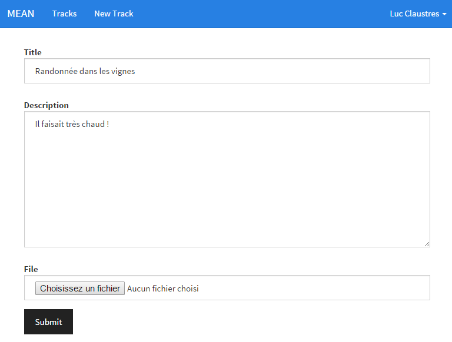

# MEAN.IO (2/3)

Ce second article d'une série consacrée à MEAN.IO va nous permettre d'introduire les principaux concepts permettant de créer un nouveau module afin d'étendre le canevas. Le cas d'application que je vous propose d'étudier permettra également à la plupart d'entre vous de découvrir un autre domaine, celui de la visualisation de données géographiques sous forme de carte ou sous forme 3D. Nous souhaitons en effet créer une application permettant de visualiser un ou plusieurs itinéraires GPS (type randonnée VTT ou pédestre).

## Création d'un module

Tout d'abord un petit rappel, l'ensemble des modules d'une application MEAN.IO est stocké dans le dossier **packages**. Le premier sous-dossier **core** inclut les modules de base livrés avec le framework et le sous-dossier **custom** les modules spécifiques à la logique applicative, c'est donc ici qu'il faudra créer vos nouveaux modules. Grâce à l'outil en ligne de commande [mean-cli](https://www.npmjs.com/package/mean-cli) il est possible d'initialiser un module (scaffolding) via :
```
mean package package_name
```
Il est à tout moment possible de lister vos modules et d'effacer un module en particulier :
```
// Liste les modules présents
mean list
// Efface un module
mean uninstall package_name
```

Le dossier d'un module MEAN.IO présente la structure suivante (un module nouvellement créé peut ne pas contenir tous les dossiers néanmoins) :
```
Module folder
--- docs : contient la documentation de l'API (back-end)
--- public : partie publique du module sur le site
    --- assets : données statiques (images, css, dépendances front-end)
    --- controllers : controllers front-end (AngularJS)
    --- directives : directives front-end (AngularJS)
    --- routes : routing front-end (AngularUI Router)
    --- services : services front-end (AngularJS)
    --- tests : tests front-end (Jasmine)
    --- views : vues (AngularJS)
--- server : contient le code back-end
    --- controllers : controllers back-end (Express)
    --- routes : routing back-end (Express)
    --- models : modèle de données back-end (Mongoose)
    --- tests : tests back-end (Jasmine)
    --- views : vues HMTL (templating Swig)
--- node_modules : contient les dépendances Node.js du module (back-end)
```
> **Trucs & Astuces** : Tous les fichiers à l'intérieur du dossier **public** seront accessibles publiquement à l'URL */nom-module/chemin-relatif-fichier*. Par exemple pour accéder à une image nommé 'logo.png' dans le module nommé 'module' l'URL sera *module/assets/img/logo.png*.

A la racine on trouvera comme dans le cas de l'application les fichiers de configuration pour npm, bower et MEAN.IO (**mean.json**). Le plus important est le fichier **app.js** qui est le point d'entrée du module, à l'intérieur est réalisé l'enregistrement du module dans MEAN.IO. Créons un nouveau module nommé 'application' qui contiendra notre logique applicative, dans le fichier **app.js** généré par défaut nous trouverons ceci :
```javascript
var Module = require('meanio').Module;
// Création du module, ceci va automatiquement charger tous les modèles du sous-dossier models
var Application = new Module('application');
// Enregistrement du module
Application.register(function(app, auth, database) {
  // Déclaration automatique des routes du sous-dossier routes
  Application.routes(app, auth, database);
  // Aggrégation des dépendances front-end (voir article précédent)
  Application.aggregateAsset('css', 'application.css');

  return Application;
});
```
Si votre nouveau module dépend d'autres modules MEAN.IO ou AngularJS il vous faudra rajouter ceci lors du register :
```javascript
Application.angularDependencies(['mean.users']);
```
En effet l'arbre des dépendances est construit côté serveur au lancement de l'application et est récupéré au chargement de la page via une requête sur l'URL */_getModules* côté client. Ceci permet de déclarer alors dynamiquement la liste de tous les modules AngularJS dans le code JS (pour les curieux vois le fichier **bower_components/web-bootstrap/index.js**).

Par défaut MEAN.IO injecte trois dépendances en paramètre du register :

  - **app** : l'application Express,
  - **auth** : un module proposant des fonctions d'authenticatio basiques,
  - **database** : la connexion Mongoose à la base de données.
 
Si votre module dépend d'autres modules (e.g. module1 et module2) ils pourront être injectés à la suite :
```javascript
...
// Enregistrement du module
Application.register(function(app, auth, database, module1, module2) {
  ...
});
```

> **Trucs & Astuces** : par défaut, à l'intérieur de chaque module de base de MEAN.IO, les fichiers portent le même nom (celui du module comme par exemple *Module.js*). Vous verrez que dans la suite je préfère suffixer chaque fichier par le type d'objet qu'il contient (par exemple *ModuleController.js*, *ModuleRoutes.js*, etc.). En effet, même si le nom du dossier parent peut servir de discriminant, il est ainsi plus aisé de savoir à quel fichier l'on a affaire. Notamment lorsqu'ils sont ouverts simultanément sous forme d'onglets ne laissant apparaitre que le nom du fichier (et non le chemin complet) dans votre éditeur de texte favori. 

## Partie serveur (back-end)

### Création du modèle

Le premier travail lors de la création d'un module consiste à définir le modèle conceptuel du ou des objets qui seront manipulés par le module, ce modèle est ensuite exprimé au moyen d'un schéma Mongoose. Dans notre cas l'objet manipulé sera un itinéraire GPS ('track' en anglais). Un tel chemin est simplement décrit par une liste de positions GPS acquises par le capteur. Chaque point est repéré en coordonnées géographiques : longitude, latitude et altitue. A part l'utilisateur qui l'a créé et un descriptif le chemin contiendra donc un tableau de coordonnées. Pour déclarer le modèle il suffit de créer un fichier **TrackModel.js** dans le dossier **models** du module, il contiendra le schéma suivant :
```javascript
'use strict';

var mongoose = require('mongoose'),
    Schema = mongoose.Schema;

// Déclaration du schéma du modèle 'Track'
var TrackSchema = new mongoose.Schema({
  // Utilisateur ayant créé le chemin
  user : {
  	type: mongoose.Schema.Types.ObjectId,
  	ref: 'User' // Référence le modèle d'utilisateur de MEAN.IO
  },
  // Date de création
  created: {
    type: Date,
    default: Date.now
  },
  // Titre du chemin
  title: {
    type: String,
    required: true,
    trim: true
  },
  // Description associée au chemin
  description : {
  	type : String, required : true
  },
  // Liste des points de passage constituant le chemin (coordonnées géographiques)
  waypoints : {
  	type : [Number], required : false
  }
});
// Ajout d'une fonction de validation pour le titre et la description
TrackSchema.path('title').validate(function(title) {
  return !!title;
}, 'Title cannot be blank');
TrackSchema.path('description').validate(function(description) {
  return !!description;
}, 'Description cannot be blank');
// Méthode utilisée pour récupérer un chemin via son ID,
// va récupérer certaines des informations de l'utilisateur via populate
TrackSchema.statics.getById = function(id, cb) {
  this.findOne({
    _id: id
  }).populate('user', 'name username').exec(cb);
};

mongoose.model('Track', TrackSchema);
```

### Création des routes

Une fois le modèle créé, la seconde étape consiste à définir l'API REST qui permettra de le manipuler via les classiques opérations CRUD (création, lecture, mise à jour et destruction) et éventuellement d'autres opérations plus spécifiques à votre modèle. Une route consiste à associer un point d'entrée de l'API (i.e. une URL avec une méthode HTTP) à la fonction de traitement JavaScript associée au sein d'un contrôleur. Pour déclarer les routes il suffit donc de créer un fichier **TrackRoutes.js** dans le dossier **routes** du module, il contiendra le code suivant :
```javascript
'use strict';

// Récupération du contrôleur
var track = require('../controllers/TrackController');

// Fonction pour vérifier les droits d'accès à l'API
var hasAuthorization = function(req, res, next) {
  // Un utilisateur ne peut modifier que ses propres chemins 
  if (!req.track.user._id.equals(req.user._id)) {
    return res.status(401).send('User is not authorized');
  }
  next();
};

module.exports = function(Application, app, auth, database) {
    // Déclaration des routes
    app.route('/api/track')
        .get(auth.requiresLogin, track.list)
        .post(auth.requiresLogin, track.create);
    app.route('/api/track/count')
        .get(auth.requiresLogin, track.count);
    app.route('/api/track/:trackId')
        .get(auth.isMongoId, auth.requiresLogin, track.get)
        .put(auth.isMongoId, auth.requiresLogin, hasAuthorization, track.update)
        .delete(auth.isMongoId, auth.requiresLogin, hasAuthorization, track.destroy);

    app.param('trackId', track.findById);
};
```
On note l'ajout d'une fonction d'autorisation (middleware Express) spécifique à notre modèle car seul l'utilisateur qui a créé un chemin est autorisé à le modifier. On notera également l'appel à des fonctions de vérification d'authentification de l'utilisateur ou de validité de l'identifiant d'un chemin qui sont fournies par MEAN.IO.

### Test de l'API

Afin de tester l'API j'utilise l'extension Chrome [Postman](https://chrome.google.com/webstore/detail/postman/fhbjgbiflinjbdggehcddcbncdddomop?hl=en). Cet outil permet d'envoyer des requêtes HTTP selon tout type de méthode (GET, POST, PUT, DELETE, etc.) et de créer des collections de templates de requête afin de pouvoir faire des tests rapides sur une API de type REST. Pour pouvoir l'utiliser avec MEAN.IO il faut tout d'abord récupérer un token JWT (voir article précédent) qui devra être adjoint à toutes les requêtes faites vers l'API. Pour cela le plus simple est de créer une requête de type POST vers l'URL */api/login* avec une charge utile (i.e. un body) contenant l'e-mail et le mot de passe de l'utilisateur de l'application préalablement créé (Figure 1).


La réponse renvoyé contient votre token (Figure 2). Il faudra ensuite introduire ce token dans le header de vos prochaines requêtes en respectant le standard [Bearer](http://self-issued.info/docs/draft-ietf-oauth-v2-bearer.html).


Ainsi le requête GET vers l'URL */api/track* à la Figure 3 va donner une réponse de status 200 ('OK') avec la charge utile `[]` (puisque nous n'avons créé aucun chemin à ce stade). Sans le token une réponse de status 401 ('User is not authorized') aurait été obtenue. Vous pouvez essayer de créer un chemin à la main en fournissant simplement un descriptif dans le corps de votre requête POST sur */api/track* puisque l'utilisateur sera automatiquement renseigné et que les coordonnées ne sont pas requises pour l'example.


### Création du menu

Pour rajouter des entrées dans la barre de menu de MEAN.IO il suffit de les déclarer dans votre **app.js** en précisant pour chacune le titre, les rôles autorisés à la voir et l'état à activer côté client (voir ci-après dans la partie cliente). Dans notre cas nous aurons simplement deux entrées, une pour lister tous nos chemins et une pour créer un nouveau chemin :
```javascript
// Ajout des entrées de menu pour les utilisateurs authentifiés
Application.menus.add({
    'roles': ['authenticated'],
    'title': 'Tracks',
    'link': 'list tracks'
});
Application.menus.add({
    'roles': ['authenticated'],
    'title': 'New Track',
    'link': 'create track'
});
```

## Partie cliente (front-end)

### Service

La partie service est réellement la plus simple étant donné que le service [$resource](https://docs.angularjs.org/api/ngResource/service/$resource) d'AngularJS est spécifiquement fait pour encapsuler une API de type REST. Pour déclarer notre service d'accès à l'API des chemins il suffit de créer un fichier **TrackService.js** dans le dossier **services** de la partie publique, il contiendra la déclaration suivante :
```javascript
// Service utilisé pour accéder à l'API REST des chemins
angular.module('mean.application').factory('TrackService', ['$resource',
  function($resource) {
    return $resource('api/track/:trackId', {
      trackId: '@_id'
    }, {
      update: {
        method: 'PUT'
      }
    });
  }
]);
```
### Routes

Les routes côté front-end sont gérées via l'[AngularUI Router](https://github.com/angular-ui/ui-router). Ce module permet d'organiser la navigation sous la forme d'une machine à état. Dans la version simple à chaque état est associé une URL, une vue, et un contrôleur. Dans la version plus complexe il est possible d'imbriquer les machines à état. Pour déclarer les routes il suffit de créer un fichier **ApplicationRoutes.js** dans le dossier **routes** de la partie publique, il contiendra dans notre cas les déclarations permettant d'accéder aux pages pour lister nos chemins, créer un nouveau chemin, éditer un chemin et le visualiser (via son identifiant de base de données)  :
```javascript
// Definition des routes pour les chemins
angular.module('mean.application').config(['$stateProvider',
  function($stateProvider) {

    // Page listant tous les chemins de l'utilisateur
    $stateProvider
      .state('list tracks', {
        url: '/tracks',
        templateUrl: '/application/views/ListTracks.html',
        controller: 'TrackController',
        resolve: {
          loggedin: function(MeanUser) {
            return MeanUser.checkLoggedin();
          }
        }
      })
      // Page permettant de créer un nouveau chemin
      .state('create track', {
        url: '/track/create',
        templateUrl: '/application/views/CreateTrack.html',
        controller: 'TrackController',
        resolve: {
          loggedin: function(MeanUser) {
            return MeanUser.checkLoggedin();
          }
        }
      })
      // Page permettant d'éditer un chemin
      .state('edit track', {
        url: '/track/:trackId/edit',
        templateUrl: '/application/views/EditTrack.html',
        controller: 'TrackController',
        resolve: {
          loggedin: function(MeanUser) {
            return MeanUser.checkLoggedin();
          }
        }
      })
      // Page permettant de voir un chemin
      .state('view track', {
        url: '/track/:trackId',
        templateUrl: '/application/views/ViewTrack.html',
        controller: 'TrackController',
        resolve: {
          loggedin: function(MeanUser) {
            return MeanUser.checkLoggedin();
          }
        }
      });
  }
]);
```
### Contrôleur

Notre contrôleur sera un contrôleur AngularJS classique mais nous allons faire en sorte qu'il gère les actions nécessaires à tous les états se rapportant aux chemins pour centraliser le comportement par type d'objet manipulé (dans notre cas il n'y a pour l'instant qu'un seul type d'objet). La méthode `find` récupère côté serveur la liste des chemins existants et `findOne` celui dont l'ID est présent dans l'URL. La méthode `create` est appellée lors de la soumission du formulaire de création d'un chemin, qui a préalablement remplit l'objet `track` du scope. De même pour la méthode `edit`, la seule différence étant que l'objet `track` est dans ce cas préalablement récupéré sur le serveur puis mis à jour. Enfin, la méthode `remove` détruit le chemin fourni en paramètre ou sinon celui en cours d'édition. Toutes ces méthodes seront appellées par les différentes vues de l'application.
```javascript
// Contrôleur utilisé pour gérer les chemins
angular.module('mean.application').controller('TrackController', ['$scope', '$stateParams', '$location', 'TrackService', 
  function($scope, $stateParams, $location, TrackService) {
    // Objet par défaut pour le mode création
    $scope.track = { };
    // Créé un nouveau chemin
    $scope.create = function(isValid) {
      if (isValid) {
        var payload = {
          title: $scope.track.title,
          description: $scope.track.description
        };
        var track = new TrackService(payload);
        track.$save(function(response) {
          $location.path('tracks');
        });

        $scope.track.title = '';
        $scope.track.description = '';
      } else {
        $scope.submitted = true;
      }
    };
    // Détruit un chemin existant
    $scope.remove = function(track) {
      if (track) {
        track.$remove(function(response) {
          for (var i in $scope.tracks) {
            if ($scope.tracks[i] === track) {
	             $scope.tracks.splice(i,1);
            }
          }
          $location.path('tracks');
        });
      } else {
        $scope.track.$remove(function(response) {
          $location.path('tracks');
        });
      }
    };
    // Met à jour un chemin existant
    $scope.update = function(isValid) {
      if (isValid) {
        var track = $scope.track;
        track.$update(function() {
          $location.path('track/' + track._id);
        });
      } else {
        $scope.submitted = true;
      }
    };
    // Liste tous les chemins de l'utilisateur
    $scope.find = function() {
      TrackService.query(function(tracks) {
        $scope.tracks = tracks;
      });
    };
    //Récupère un chemin via son ID
    $scope.findOne = function() {
      TrackService.get({
        trackId: $stateParams.trackId
      }, function(track) {
        $scope.track = track;
      });
    };
  }
]);
```

### Vues

Concernant les vues nous avons tout d'abord besoin d'une présentation sous forme de liste de tous les chemins exitants. Pour ce faire nous utiliserons des [panels](http://getbootstrap.com/components/#panels) Bootstrap. L'en-tête (classe CSS *panel-heading*) contiendra le nom de notre chemin, le pied (classe CSS *panel-footer*) contiendra la date de création et le nom de l'auteur, et le corps (classe CSS *panel-body*) contiendra sa description. Ainsi nous crééons une page permettant d'afficher le contenu d'un chemin qui sera utilisée (via un `ng-include`) dans la vue listant tous les chemins (via un `ng-repeat`), mais aussi dans celle permettant d'afficher les information d'un chemin en particulier via son ID. Pour la création et l'édition la démarche est identique : nous crééons un formulaire permettant d'éditer le contenu d'un chemin qui sera utilisée (via un `ng-include`) dans la vue de création d'un chemin, mais aussi dans celle permettant d'éditer les information d'un chemin en particulier via son ID. La page de visualisation d'un chemin (Figure 4) créé dans **public/views/Track.html** se présente ainsi :
```html
<!-- Nom du chemin -->
<div class="panel panel-default">
  <!-- Un clic sur l'en-tête provoque l'uverture du corps du panneau -->
  <div class="text-center panel-heading" ng-click="track.isOpen = !track.isOpen">{{track.title}}
    <!-- Actions associés au chemin (delete/edit) -->
    <a data-ng-click="remove(track); $event.stopPropagation();"><i class="pull-right glyphicon glyphicon-trash" tooltip="Remove track" tooltip-trigger="mouseenter" tooltip-placement="top">&nbsp;</i></a>
    <a href="/track/{{track._id}}/edit"><i class="pull-right glyphicon glyphicon-edit" tooltip="Edit track" tooltip-trigger="mouseenter" tooltip-placement="top">&nbsp;</i></a>
  </div>
  <!-- Description du chemin -->
  <div collapse="!track.isOpen">
    <div class="panel-body">
      {{track.description}}
    </div>
    <!-- Date/auteur du chemin -->
    <div class="panel-footer">
      <em >Created {{track.created | date:'medium'}} by {{track.user.name}}</em>
    </div>
  </div>
</div>
```


Le formulaire d'édition d'un chemin (Figure 5) créé dans **public/views/TrackEditor.html** se présente ainsi :
```html
<!-- Si l'objet contient déjà unID de base de données alors nous sommes en mode édition, sinon en mode création -->
<form name="trackForm" class="form-horizontal col-md-6" role="form" data-ng-submit="track._id ? update(trackForm.$valid) : create(trackForm.$valid)" novalidate>
  <div class="form-group" ng-class="{ 'has-error' : submitted && trackForm.title.$invalid }">
    <label mean-token="'edit-title'" for="title" class="col-md-2 control-label">Title</label>
    <div class="col-md-10">
      <input name="title" type="text" class="form-control" data-ng-model="track.title" id="title" placeholder="Title" required>
      <div ng-show="submitted && trackForm.title.$invalid" class="help-block">
        <p ng-show="trackForm.title.$error.required">Title is required</p>
      </div>
    </div>
  </div>
  <div class="form-group" ng-class="{ 'has-error' : submitted && trackForm.description.$invalid }">
    <label mean-token="'edit-description'" for="description" class="col-md-2 control-label">Description</label>
    <div class="col-md-10">
      <textarea name="description" data-ng-model="track.description" id="description" cols="30" rows="10" placeholder="Description" class="form-control" required></textarea>
      <div ng-show="submitted && trackForm.description.$invalid" class="help-block">
        <p ng-show="trackForm.description.$error.required">Description is required</p>
      </div>
    </div>
  </div>
  <div class="form-group">
    <label mean-token="'edit-file'" for="file" class="col-md-2 control-label">File</label>
    <div class="col-md-10">
      <input name="file" type="file" class="form-control" file="track.file" id="file" placeholder="File">
    </div>
  </div>
  <div class="form-group">
    <div class="col-md-offset-2 col-md-10">
      <button mean-token="'edit-submit'" type="submit" class="btn btn-default">Submit</button>
    </div>
  </div>
</form>
```



## Gestion des données géographiques

A ce stade, nous n'avons aucun moyen d'ingérer dans notre application ce qui nous intéresse finalement le plus, à savoir le chemin qui a été suivi et que l'on souhaite représenter. Comme ce type de données est généralement acquis de façon automatisée (via un GPS) et trop volumineux pour être ingéré manuellement, nous allons créer différentes fonctions permettant de facilement remplir notre base de données avec ces informations.

Dans le domaine il existe de nombreux formats mais les plus usités concernant une trace GPS sont probablement ces deux-là (tous deux basés sur XML) :

 * [GPX](http://www.topografix.com/gpx.asp) (GPS eXchange Format), un format ouvert permettant de décrire une collection de points utilisables sous forme de chemin (waypoint), trace (track) ou itinéraire (route).
 * [KML](http://www.opengeospatial.org/standards/kml/) (Keyhole Markup Language), un format basé sur [COLLADA](https://www.khronos.org/collada/) et popularisé par Google mais qui est aujourd'hui devenu un standard international.

Afin d'optimiser le stockage en base de ces données, nous avons toutefois utilisé un tableau de coordonnées brutes au sein de notre modèle. Pour simplifier le code de conversion nous passeront par un format pivot vers lequel seront transformées les données d'entrée GPX/KML. Afin de disposer d'une API facilement utilisable par des librairies cartographiques, nous souhaitons également utiliser ce format pivot en sortie. Nous focaliserons ainsi nos efforts sur le code de conversion du format pivot vers/depuis notre base de données.

Le format pivot qui s'impose de lui-même pour un code JavaScript est [GeoJSON](http://geojson.org/) (de l'anglais Geographic JSON), qui est un format ouvert d'encodage de données géographiques basé sur la norme JSON (JavaScript Object Notation). Il permet de décrire des données de type point, ligne, polygone, ainsi que des ensembles de ces types de données et d'y ajouter des attributs quelconques. Il est de plus supporté par la plupart des librairies traitant l'information géographique. Enfin, il existe le module Node.js [togeojson](https://github.com/mapbox/togeojson) qui permet de convertir un arbre XML au format KML/GPX en GeoJSON. Il suffit donc de coupler ce module à un module de parsing de flux XML tel que [jsdom](https://github.com/tmpvar/jsdom) pour obtenir très simplement la conversion de nos données d'entrée. Etant donné que ces informations sont volatiles nous utilisons naturellement un attribut virtuel de Mongoose (en écriture seulement) pour ce faire. Ainsi, une fois rajouté les deux dépendances Node.js au **package.json** de notre module MEAN.IO nous insérons le code suivant dans notre modèle pour convertir les données d'entrée :
```javascript
var togeojson = require('togeojson'),
    jsdom = require('jsdom').jsdom;
    
// Setter permettant de remplir le chemin à partir de données au format KML
TrackSchema.virtual('kml')
.set(function (data) {
  if ( data ) {
    var kml = jsdom(data);
    var geojson = togeojson.kml(kml);
    this.set( 'geojson', geojson );
  }
});
// Code identique pour gérer le format GPX
...
```
Le code de conversion repose lui-même sur un attribut virtuel permettant de stocker en base les données converties dans notre format pivot (i.e. GeoJSON). Etant donné que nous utilisons ce format également en sortie cet attribut est cette fois en lecture/écriture. Si la conversion vers le GeoJSON est triviale, celle depuis le GeoJSON est un peu plus complexe selon les différents types de données d'entrée, je ne laisse donc ici que le cas le plus simple (voir le code de l'article pour l'exemple complet) :
```javascript
// Getter permettant de récupérer le chemin au format GeoJSON
TrackSchema.virtual('geojson')
.get(function () {
  var coordinates = [];
  // En GeoJSON chaque point est lui-même un tableau alors que nous stockons tout à plat
  for (var i = 0; i < this.waypoints.length / 3; i++) {
    coordinates[i] = [ this.waypoints[3*i], this.waypoints[3*i+1], this.waypoints[3*i+2] ];
  }
  // Encapsulation des coordonnées dans le formalisme GeoJSON
  var feature = {
    "type": "Feature",
        "geometry": {
      "type": "LineString",
      "coordinates": coordinates
    }
  };
  
  return feature;
})
// Setter permettant de remplir le chemin à partir de données au format GeoJSON
.set(function (geojson) {
  if ( geojson && geojson.type == 'LineString' ) {
    // Récupération des coordonnées
    var coordinates = geojson.coordinates;
    var waypoints = [];
    
    // En GeoJSON chaque point est lui-même un tableau alors que nous stockons tout à plat
    for (var i = 0; i < coordinates.length; i++) {
      waypoints[3*i] = coordinates[i][0];
      waypoints[3*i+1] = coordinates[i][1];
      // De plus nous stockons toujours l'altitude alors qu'en GeoJSON elle peut être absente
      if ( coordinates[i].length >= 3 ) {
        waypoints[3*i+2] = coordinates[i][2];
      } else {
        waypoints[3*i+2] = 0;
      }
    }
    
    this.set( 'waypoints', waypoints );
  }
});
```

> **Trucs & Astuces** : depuis la version 2.4 MongoDB supporte nativement le stockage de données au format GeoJSON (http://docs.mongodb.org/v2.6/reference/geojson/), il serait donc tout à fait possible de stocker directement l'objet GeoJSON pour simplifier la manipulation mais en complexifiant la structure de données

Il ne nous reste plus qu'à permettre à l'utilisateur de fournir un fichier KML ou GPX afin d'alimenter notre base de données. Dans une application réelle le fichier serait tout d'abord transféré sur le serveur puis traité côté serveur afin d'optimiser la bande passante et de s'affranchir des limites de taille. Néanmoins, dans l'optique de simplifier notre exemple, nous allons lire le fichier côté client et envoyer directement les données lues avec la requête de création ou d'édition du chemin. Ainsi, seule la conversion en GeoJSON se réalisera côté serveur. Grâce aux attributs virtuels de notre modèle il suffit de rajouter une propriété `kml` ou `gpx` au contenu de notre requête pour que la magie opère ! Pour faire cela simplement j'ai créé une directive AngularJS (voir code complet de l'article) qui à chaque changement dans le sélecteur de fichier de notre formulaire va récupérer le nom et le contenu du fichier sélectionné dans la propriété `file` (qui est en fait un objet) du chemin courant. Cette directive se base sur la nouvelle [File API](http://www.w3.org/TR/file-upload/) d'HTML5. Au niveau du contrôleur l'ajout du contenu du fichier dans la propriété adéquate de note modèle (`kml` ou `gpx`) se base sur l'extension du fichier lu:
```javascript
...
    var track = $scope.track;
    // Ajout du contenu du fichier si présent
    if ( track.file.content ) {
      track[track.file.extension] = track.file.content;
    }
...
```

## Conclusion

Cet article a été l'occassion d'approfondir votre connaissance du framework MEAN.IO qui vous avez été présenté succinctement lors du précédent article. Tout d'abord par la mise en place d'un nouveau module, ensuite par la création d'un modèle de données et de l'API REST permettant de le manipuler, enfin par une partie cliente incluant des interfaces homme-machine (IHM) pour la présentation et l'édition des données. Lors du prochain épisode nous terminerons en beauté avec la visualisation de nos chemins sous formes de cartes à la façon "Google Maps" ou de vues 3D à la façon "Google Earth".


